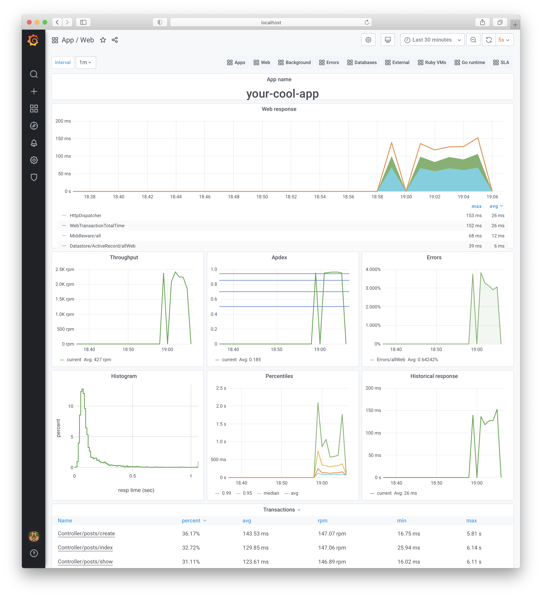

# Statsbit



It is the [NewRelic](https://newrelic.com) drop-in replacement.
It works with all NewRelic's agents that support
[the 17th protocol version](https://github.com/newrelic/newrelic-ruby-agent/search?q=PROTOCOL_VERSION).
In BIA we use agents on ruby, python, go, java.

Statsbit isn't a full NewRelic replacement. It doesn't support browser monitoring, distribution tracing, and so on.
But if you want to store your data behind the firewall and can use only basic features, you're in the right place.

Statsbit consists of Backend and UI.
Backend is written in Clojure and stores data in [TimescaleDB](https://www.timescale.com).
UI is built on top of [Grafana](https://grafana.com).

## Example

+  git clone https://github.com/bia-technologies/statsbit.git
+ cd statsbit/example
+ docker-compose up -d statsbit-timescale statsbit-postgres app-postgres
+ wait a second
+ docker-compose up
+ open [grafana](http://localhost:8080/d/yihqdWZWk/web?orgId=1&var-app_id=1&refresh=5s)
   + user: admin
   + password: admin_password
+ it requires some time to send the first metrics, so just wait a minute
+ that's it!

## Requirements

Statsbit requires Postgres with the Timescale extension.
We run It on Postgres 11 and 12 with Timescale 1.7.4.
I'm going to support Timescale 2.0 too.

Also, every NewRelic agent requires a valid SSL certificate for the backend.

Statsbit distributes via docker images, so you need Docker to run it. We run it in our Kubernetes cluster.

And of course, you need a lot of free disk space. It takes us about 500 GB to store data for 6 months.

## Install

You can found docker images [here](https://hub.docker.com/r/biatechru/statsbit/tags?page=1&ordering=last_updated).
There are two images:

+ biatechru/statsbit:master-backend-{{ N }}-{{ SHA }}
+ biatechru/statsbit:master-grafana-{{ N }}-{{ SHA }}

Also, you need to use the backend containers with a reverse proxy with a valid SSL certificate. For example, you can use Nginx or Kubernetes Ingress Controller.

## Configuration

Both Backend and UI are configurable via environment variables.

### Backend

```
STATSBIT_BACKEND_MIGRATION_LOCATIONS=db/migration/common,db/migration/timescale_1.x,db/migration/prod_server_1.x

STATSBIT_BACKEND_PORT=3000

STATSBIT_BACKEND_DB_POOL_ACQUIRE_INCREMENT=1
STATSBIT_BACKEND_DB_POOL_MIN_POOL_SIZE=1
STATSBIT_BACKEND_DB_POOL_MAX_POOL_SIZE=4

STATSBIT_BACKEND_JETTY_MIN_THREADS=1
STATSBIT_BACKEND_JETTY_MAX_THREADS=4

STATSBIT_BACKEND_DB_NAME=statsbit_db
STATSBIT_BACKEND_DB_HOST=1.1.1.1
STATSBIT_BACKEND_DB_PORT=5432
STATSBIT_BACKEND_DB_USER=statsbit_user
STATSBIT_BACKEND_DB_PASSWORD=statsbit_password
```

`STATSBIT_BACKEND_MIGRATION_LOCATIONS` is a comma separated list of paths:

+ `db/migration/common` - contains common migrations
+ `db/migration/timescale_1.x` - contains migrations for timescale 1.x
+ `db/migration/prod_server_1.x` - contains default settings for a production server that stores data for 6 months.
+ `db/migration/test_server_1.x` - contains default settings for a test server that stores data for 1 month.

Also, I'm going to add following paths for TimescaleDB 2.0

+ `db/migration/timescale_2.x`
+ `db/migration/prod_server_2.x`
+ `db/migration/test_server_2.x`

Statsbit uses FlyWay's migrations. So you can add custom migration in classpath, filesystem or aws s3.
Please read its [documentation](https://flywaydb.org/documentation/configuration/parameters/locations).
For example:
`STATSBIT_BACKEND_MIGRATION_LOCATIONS=db/migration/common,db/migration/timescale_1.x,filesystem:/path/to/your/server/migrations`.

You can also configure [Sentry](https://sentry.io/) and even NewRelic.

```
STATSBIT_BACKEND_SENTRY_DSN=http://some_dsn

NEW_RELIC_APP_NAME=statsbit
NEW_RELIC_LOG_LEVEL=info
NEW_RELIC_LOG=stdout
NEW_RELIC_LICENSE_KEY=some_license
NEW_RELIC_BROWSER_MONITORING_AUTO_INSTRUMENT=false
```

### Grafana

```
STATSBIT_GRAFANA_DATASOURCE_URL=1.1.1.1:5432
STATSBIT_GRAFANA_DATASOURCE_DATABASE=statsbit_db
STATSBIT_GRAFANA_DATASOURCE_USER=statsbit_user
STATSBIT_GRAFANA_DATASOURCE_PASSWORD=statsbit_password

STATSBIT_GRAFANA_DATASOURCE_MAX_OPEN_CONNS=4
STATSBIT_GRAFANA_DATASOURCE_MAX_IDLE_CONNS=2
STATSBIT_GRAFANA_DATASOURCE_CONN_MAX_LIFETIME=14400

GF_SECURITY_ADMIN_PASSWORD=admin_password

GF_DATABASE_TYPE=postgres
GF_DATABASE_HOST=1.1.1.1:5432
GF_DATABASE_NAME=grafana_db
GF_DATABASE_USER=grafana_user
GF_DATABASE_PASSWORD=grafana_password
```

Please check out other [Grafana's settings](https://grafana.com/docs/grafana/latest/administration/configuration/). For example, you can configure LDAP.

## Client configuration

You can use any NewRelic's client that supports the 17th version of the protocol.
Please search `protocol_version` in the source code of the client.

```
NEW_RELIC_APP_NAME=your-cool-app
NEW_RELIC_AGENT_ENABLED=true

# It's required to use a valid ssl sertificate
NEW_RELIC_HOST=backend.your-company.com

# please check this path, it may be different
NEW_RELIC_CA_BUNDLE_PATH=/etc/ssl/certs/ca-bundle.crt
# NEW_RELIC_CA_BUNDLE_PATH=/etc/ssl/certs/ca-certificates.crt

NEW_RELIC_LICENSE_KEY=any-license # required but not used

# for debugging
NEW_RELIC_LOG=stdout
NEW_RELIC_LOG_LEVEL=debug # or 'info'
```

## Tips

```sql
-- Drop all chunks older than 3 months ago:
SELECT drop_chunks(interval '3 months');
```

***

If you can't use an SSL certificate and you use the ruby agent, then you can disable this requirement by monkey-patching:

```ruby
module NewRelicPatch
  module NewRelicService
    def setup_connection_for_ssl(conn)
      super conn
      conn.use_ssl = false
    end
  end
end

NewRelic::Agent::NewRelicService.prepend NewRelicPatch::NewRelicService
```

***

If you have a problem with Grafana migrations, please read this [issue](https://github.com/grafana/grafana/issues/17771#issuecomment-510407530)


## Naming

Early I maintained [a fork](https://github.com/Undev/errbit) of Errbit
that used Postgres instead of MongoDB, so I chose a similar name.

## License

Copyright © 2020 [BIA-Technologies Limited Liability Company](http://bia-tech.ru/)

Distributed under the [Apache License, Version 2.0](http://www.apache.org/licenses/LICENSE-2.0.html)
